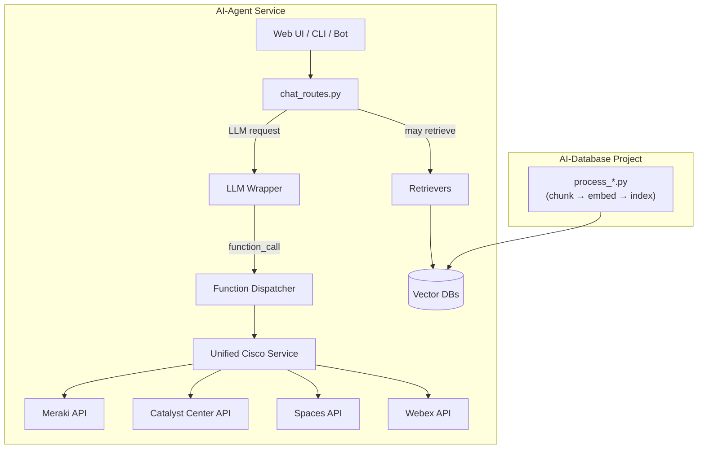

 
# **Cisco AI Building Blocks Suite**
 

> **DISCLAIMER — USE AT YOUR OWN RISK**
> This software is provided **“as is”** without warranty of any kind.
> Cisco Systems, Inc. and contributors accept **no liability** for damages arising from its use.
> The project is intended *solely for demonstration and development*.
> By cloning or running the code you confirm that you have read and accepted these terms.

---

## Cisco AI Building Blocks — *Full Suite*

A modular starter-kit for building **retrieval-augmented Gen‑AI** solutions on Cisco platforms.

* **AI-Agent Service** — FastAPI micro‑service that merges LLMs, RAG, and live Cisco APIs.
* **AI-Database Project** — data‑engineering pipeline that chunks, embeds, and indexes your docs/events.

Use them together or independently to prototype chatbots, copilots, and automated IT‑ops on Meraki, Catalyst Center, Spaces, Webex, Nexus, and beyond.

---

## 1 · Key Features

| Capability                | Suite‑Level Benefit                                                                                          |
| ------------------------- | ------------------------------------------------------------------------------------------------------------ |
| **Pluggable stack**       | Swap LLM (Azure OpenAI, Llama 3, local HF) & vector DB (Azure Search, Chroma, Elastic) via `.env`.           |
| **Layered RAG**           | Separate indexes for FASTAPI (API docs), EVENTS (telemetry), DOMAIN (business data), and AGENTIC (CoT docs). |
| **Live function calling** | LLM emits `function_call` JSON → dispatcher hits real Cisco REST APIs → results streamed back to chat.       |
| **Unified Cisco Service** | One abstraction wraps Meraki, Catalyst, Spaces, Webex (extensible to Nexus, XDR, etc.).                      |
| **Automated scaffolding** | Script generates SDK client, OpenAPI spec, dispatcher, and service stubs for any new Cisco platform.         |
| **OpenTelemetry tracing** | End‑to‑end spans for chunking, embedding, LLM calls, API latency, and more.                                  |
| **Sample UI**             | Minimal HTML/JS front‑end in `static/` for quick manual testing.                                             |

---

## 2 · High‑Level Architecture



---

## 3 · Repo Layout

```
suite-cisco-ai-building-blocks/
├── LICENSE
├── Makefile
├── README.md                       # ← you are here
├── assets/                         # banners & diagrams shared by the suite
├── example.env                     # master list of 275+ env vars
├── chroma_dbs/                     # local vector storage (git‑ignored)
├── src/
│   ├── app/                        # Agent service: routes, SDKs, retrievers, commands
│   └── db_scripts/                 # Data pipelines: process_domain, process_events, etc.
├── src/source_open_api/            # Place your platform OpenAPI specs here
└── ...
```

---

## 4 · Quick Start

```bash
# 1 Clone the repo
git clone https://github.com/APO-SRE/suite-cisco-ai-building-blocks.git
cd suite-cisco-ai-building-blocks

# 2 Copy & edit env file
cp example.env .env    # keep secret keys & endpoints out of git
# edit .env: choose your VECTOR_BACKEND, FEATURE flags, credentials, etc.

# 3 (Optional) Build initial vector indexes locally
#   - For API docs layer
python -m db_scripts.process_domain
#   - For telemetry layer
python -m db_scripts.process_events

# 4 Install in editable mode (exposes CLI wizards)
python3 -m venv .venv
source .venv/bin/activate
pip install -e .

# 5 Launch interactive menu
menu

# 6 Run the Agent service
cd src/app
uvicorn main:app --reload --log-level debug

# 7 Open Chat UI
Browse to http://127.0.0.1:8000/static/
```

---

## 5 · Connecting to Cisco Platforms (Step‑by‑Step)

### 5.1 · Place Your OpenAPI Spec

Drop your platform’s OpenAPI file into:

```
suite-cisco-ai-building-blocks/src/source_open_api
```

• Preloaded specs include Catalyst Center, SD‑WAN, Intersight, Nexus Dashboard, Spaces Location, Security Cloud, Meraki, and Nexus Hyperfabric.

If you only have a Swagger V2 doc, place it in

```
suite-cisco-ai-building-blocks/src/db_scripts/source_swagger-2
```

and run:

```bash
convert-swagger
```

A draft OpenAPI 3 file will be emitted into `src/source_open_api/` for you to refine.

### 5.2 · Install the Agent CLI

This makes all `user_commands.*` entry points available on your `$PATH`:

```bash
cd suite-cisco-ai-building-blocks
source .venv/bin/activate  # or your own venv
pip install -e .
```

You’ll now have commands:

```
menu
create-platform
reset-platform
create-sdk
delete-sdk
create-platform-index
create-domain-demo-index
create-events-index
create-platform-routes
delete-platform-routes
convert-swagger
```

**Tip:** `menu` is the quickest way to list and launch any wizard interactively.

### 5.3 · Install (or Generate) the Python SDK

#### A) Pip‑Installable SDKs

Many Cisco platforms publish PyPI packages:

| Platform        | Module Name     |
| --------------- | --------------- |
| Meraki          | `meraki`        |
| Catalyst Center | `dnacentersdk`  |
| SD‑WAN Manager  | `catalystwan`   |
| Webex           | `webexteamssdk` |

```bash
pip install meraki dnacentersdk catalystwan webexteamssdk
```

#### B) Auto‑Generate Missing SDKs

For platforms without a published SDK (e.g. Nexus Hyperfabric):

```bash
menu               # or: create-sdk
# 1) Select your spec (e.g. tortuga-schema.json)
# 2) Choose a short folder name (e.g. hyperfabric)
# 3) After generation:
pip install -e output_sdk/hyperfabric
```

### 5.4 · Scaffold & Index the New Platform

With spec + SDK in place:

1. **Scaffold code**

   ```bash
   create-platform
   ```

   → Prompts to pick your spec, then generates JSON schemas, function definitions, dispatcher, and service stubs under `src/app/llm/`.

2. **Index functions**

   ```bash
   create-platform-index
   ```

   → Choose one or all platforms; uploads the "dietified" JSON into your configured vector store (Chroma/Azure/Elastic).

Besides Cisco APIs, you can quickly spin up domain‑specific demos:

```bash
create-domain-demo-index
```

→ Chunk, embed, and index 30+ industry JSON samples in seconds.

For real‑time data enrichment, run:

```bash
create-events-index
```

→ Ingests your `events/sample_events.json`, chunks + indexes for advanced AI scenarios.

---

## 6 · Environment Blocks Cheat‑Sheet

| Prefix        | Layer Purpose                       | Typical Content                          |
| ------------- | ----------------------------------- | ---------------------------------------- |
| **FASTAPI\_** | API‑docs layer (functions & specs)  | Platform OpenAPI snippets, function defs |
| **EVENTS\_**  | Telemetry & log layer               | Raw Meraki events, syslogs, etc.         |
| **DOMAIN\_**  | Business / industry knowledge layer | Manuals, policy docs, customer data      |
| **AGENTIC\_** | Chain‑of‑thought & long‑form docs   | White‑papers, runbooks, knowledge bases  |

Full reference lives in [`example.env`](example.env).

---

## 7 · Extending the Suite

| Goal                     | One‑liner How‑To                                                                           |
| ------------------------ | ------------------------------------------------------------------------------------------ |
| **Add a Cisco platform** | `python scripts/platform_scaffolder.py --platform nexus` → tweak generated stubs.          |
| **New vector store**     | Drop an indexer class into `db_scripts/indexers/`; set `<LAYER>_VECTOR_BACKEND` in `.env`. |
| **New LLM backend**      | Implement a `BaseLLM` subclass; set `<LAYER>_LLM_PROVIDER` accordingly.                    |
| **Performance tuning**   | Tweak `<LAYER>_CHUNK_SIZE`, `<LAYER>_EMBED_BATCH_SIZE`, and OMP/CPU env vars.              |

PRs and issue reports are welcome!

---

## 8 · License

Apache 2.0 • © 2025 Cisco Systems, Inc.

---

*Made with ❤️ by the Cisco AI Building Blocks team — last updated May 2025*

> **DISCLAIMER — USE AT YOUR OWN RISK**  
> This software is provided **“as is”** without warranty of any kind.  
> Cisco Systems, Inc. and contributors accept **no liability** for damages arising from its use.  
> The project is intended *solely for demonstration and development*.  
> By cloning or running the code you confirm that you have read and accepted these terms.

---

## Cisco AI Building Blocks — *Full Suite*

A modular starter-kit for building **retrieval-augmented Gen-AI** solutions on Cisco platforms.

* **AI-Agent Service** — FastAPI micro-service that merges LLMs, RAG, and live Cisco APIs.  
* **AI-Database Project** — data-engineering pipeline that chunks, embeds, and indexes your docs/events.

Use them together or independently to prototype chatbots, copilots, and automated IT-ops on Meraki, Catalyst Center, Spaces, Webex, Nexus, and beyond.

---

## 1 · Key Features

| Capability               | Suite-Level Benefit                                                                                           |
| ------------------------ | -------------------------------------------------------------------------------------------------------------- |
| **Pluggable stack**      | Swap LLM (Azure OpenAI, Llama 3, local HF) & vector DB (Azure Search, Chroma, Elastic) via `.env`.             |
| **Layered RAG**          | Separate indexes for FASTAPI (API docs), EVENTS (telemetry), DOMAIN (business data), and AGENTIC (CoT docs).   |
| **Live function calling**| LLM emits `function_call` JSON → dispatcher hits real Cisco REST APIs → results streamed back to chat.         |
| **Unified Cisco Service**| One abstraction wraps Meraki, Catalyst, Spaces, Webex (extensible to Nexus, XDR, etc.).                       |
| **Automated scaffolding**| Script generates SDK client, OpenAPI spec, dispatcher, and service stubs for any new Cisco platform.          |
| **OpenTelemetry tracing**| End-to-end spans for chunking, embedding, LLM calls, API latency, and more.                                    |
| **Sample UI**            | Minimal HTML/JS front-end in `static/` for quick manual testing.                                               |

---

## 2 · High-Level Architecture

```mermaid
flowchart TD
    %% ── Client ─────────────────────
    BROWSER["Web UI / CLI / Bot"]

    %% ── Agent Service (runtime) ────
    subgraph Agent["AI-Agent Service"]
        CHAT[chat_routes.py]
        RETRIEVE[Retrievers]
        LLM[LLM Wrapper]
        DISPATCH[Function Dispatcher]
        SERVICE[Unified Cisco Service]
        VDB[(Vector DBs)]

        BROWSER --> CHAT
        CHAT -->|LLM request| LLM
        CHAT -->|may retrieve| RETRIEVE
        RETRIEVE --> VDB
        LLM -->|function_call| DISPATCH
        DISPATCH --> SERVICE
        SERVICE --> MERAKI[Meraki API]
        SERVICE --> CATALYST[Catalyst Center API]
        SERVICE --> SPACES[Spaces API]
        SERVICE --> WEBEX[Webex API]
    end

    %% ── Database Project (pipelines) ─
    subgraph Pipeline["AI-Database Project"]
        SCRIPTS["process_*.py<br/>(chunk → embed → index)"]
        SCRIPTS --> VDB
    end
````

---

## 3 · Repo Layout

```
suite-cisco-ai-building-blocks/
├── assets/                         # banners & diagrams
├── example.env                     # master list of 275+ env vars
├── Makefile
├── README.md                       # ← you are here
├── chroma_dbs/                     # local vector storage (git-ignored)
├── src/
│   ├── app/                        # FastAPI Agent
│   │   ├── routers/                # all API routes
│   │   └── user_commands/          # CLI wizards & menu
│   └── db_scripts/                 # data-pipeline scripts
└── pyproject.toml                  # entry-points for `menu`, `create-*`, etc.
```

---

## 4 · Quick Start

```bash
# 1. Clone the monorepo
git clone https://github.com/APO-SRE/suite-cisco-ai-building-blocks.git
cd suite-cisco-ai-building-blocks

# 2. Create & activate your Python environment
python3 -m venv .venv && source .venv/bin/activate

# 3. Copy & edit your .env
cp example.env .env
# — set your Azure keys, vector-backend choice, ENABLE_* flags, etc.

# 4. Install in editable mode (to get all CLI entrypoints)
pip install -e .

# 5. (Optional) Build initial vector indexes
#    these will populate chroma_dbs/...
create-domain-demo-index
create-events-index
create-platform-index

# 6. Run the Agent Service
serve-app                 # or `uvicorn app.main:main --reload`

# 7. Open your browser to:
http://127.0.0.1:8000/static/

# 8. At any time, run `menu` to see and launch all CLI wizards:
menu
```

---

## 5 · CLI Commands

Once you’ve installed with `pip install -e .`, all of these commands are on your `$PATH`:

| Command                          | Action                                                            |
| -------------------------------- | ----------------------------------------------------------------- |
| **menu**                         | Interactive launcher for *all* user-command wizards               |
| **create-platform**              | Scaffold a new Cisco platform (functions, stubs & OpenAPI spec)   |
| **reset-platform**               | Remove generated platform code                                    |
| **create-sdk**                   | Generate a Python SDK from an OpenAPI spec                        |
| **delete-sdk**                   | Delete a generated SDK folder                                     |
| **create-platform-index**        | Index your scaffolded platform’s functions into your vector store |
| **create-domain-demo-index**     | Index a sample domain (e.g. aerospace) for demos                  |
| **create-events-index**          | Index sample events JSON into your vector store                   |
| **create-platform-routes**       | Wizard to add new FastAPI platform routes in `app/routers/`       |
| **delete-platform-routes**       | List & remove platform route files in `app/routers/`              |
| **convert-swagger**              | Convert a Swagger 2.0 file → OpenAPI 3                            |
| **serve-app**                    | Launch the FastAPI server (`app.main:main`)                       |
| **create-index**                 | (DB) Create a new vector index via `db_scripts.create_index`      |
| **create-platform-db**           | (DB) Scaffold a new vector-DB index pipeline for a platform       |
| **generate-openapi-sdks-db**     | (DB) Create SDKs via `db_scripts.generate_openapi_sdks`           |
| **delete-platform**              | Alias for `reset-platform`                                        |

> **Tip:** just run `menu` from the repo root at any time to browse and launch any of the above wizards via an interactive, numbered menu.

---

## 6 · Environment Blocks Cheat-Sheet

| Prefix        | Layer Purpose                       | Typical Content                         |
| ------------- | ----------------------------------- | --------------------------------------- |
| **FASTAPI\_** | API-docs layer (function defs)      | OpenAPI snippets, function JSON files   |
| **EVENTS\_**  | Telemetry & log layer               | Raw events JSON, syslogs                |
| **DOMAIN\_**  | Business / industry knowledge layer | Manuals, policies, customer data        |
| **AGENTIC\_** | Chain-of-thought & long-form docs   | White-papers, runbooks, knowledge bases |

Full reference in [`example.env`](example.env).

---

## 7 · Extending the Suite

| Goal                     | One-liner How-To                                                                     |
| ------------------------ | ------------------------------------------------------------------------------------ |
| **Add a Cisco platform** | `create-platform` → answer prompts to scaffold new stubs & API clients               |
| **New vector store**     | Drop indexer class in `db_scripts/indexers/`, set `<LAYER>_VECTOR_BACKEND` in `.env` |
| **New LLM backend**      | Subclass `BaseLLM` in `app/llm/`, set `<LAYER>_LLM_PROVIDER` in `.env`               |
| **Performance tuning**   | Tweak `<LAYER>_CHUNK_SIZE`, `<LAYER>_EMBED_BATCH_SIZE`, and OMP/CPU env vars         |

PRs and issue reports are very welcome!

---

## 8 · License

Apache 2.0 • © 2025 Cisco Systems, Inc.

---

*Made with ❤️ by the Cisco AI Building Blocks team — last updated May 2025*
