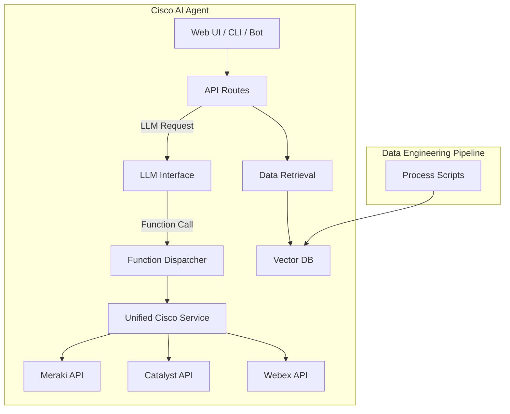

# Cisco Platform AI Project

> **DISCLAIMER — USE AT YOUR OWN RISK**
> This software is provided **“as is”** without warranty of any kind.
> Cisco Systems, Inc. and contributors accept **no liability** for damages arising from its use.
> Intended *solely for demonstration and development*.
> By cloning or running the code, you confirm acceptance of these terms.

---

## Project Overview

The Cisco Platform AI Project provides a modular toolkit for building sophisticated **retrieval-augmented Gen-AI** solutions that integrate seamlessly with Cisco platforms such as Meraki, Catalyst Center, Webex, Nexus, Spaces, and more.

This project enables rapid prototyping of intelligent chatbots, copilots, and automated IT operations leveraging live Cisco APIs, powerful LLMs, and flexible data pipelines.

---

## Key Features

| Capability                | Benefit                                                                                                   |
| ------------------------- | --------------------------------------------------------------------------------------------------------- |
| **Pluggable Stack**       | Swap out LLMs (Azure OpenAI, Llama 3, local Hugging Face) and vector DBs (Azure Search, Chroma, Elastic). |
| **Layered RAG**           | Dedicated indexes for API docs, telemetry, business data, and detailed CoT documentation.                 |
| **Live Function Calling** | Execute real Cisco API calls dynamically through JSON-emitted LLM responses.                              |
| **Unified Cisco Service** | Single abstraction layer integrates Meraki, Catalyst Center, Webex, and more platforms.                   |
| **Automated Scaffolding** | Automatically generate SDK clients, OpenAPI specs, dispatchers, and API stubs.                            |
| **OpenTelemetry Tracing** | Comprehensive visibility into chunking, embedding, LLM calls, API latencies, etc.                         |
| **Sample UI**             | Simple HTML/JS front-end included for immediate testing.                                                  |

---

## Architecture



---

## Repository Structure

```
suite-cisco-ai-building-blocks/
├── LICENSE
├── README.md                       # ← you are here
├── Makefile
├── assets/                         # shared banners & diagrams
├── example.env                     # environment variable template
├── chroma_dbs/                     # local vector DB storage (ignored by git)
├── src/
│   ├── app/                        # AI Agent service
│   │   ├── routers/                # API routes
│   │   └── user_commands/          # CLI wizards
│   ├── db_scripts/                 # data processing scripts
│   └── source_open_api/            # OpenAPI specifications
├── docs/
│   └── GettingStarted.md           # detailed getting started guide
└── pyproject.toml                  # entry-points configuration
```

---

## Quick Start

```bash
# 1. Clone the repository
git clone https://github.com/APO-SRE/suite-cisco-ai-building-blocks.git
cd suite-cisco-ai-building-blocks

# 2. Setup Python virtual environment
python3 -m venv .venv
source .venv/bin/activate

# 3. Configure your environment
cp example.env .env
# edit your .env to set credentials, vector backends, LLM providers, etc.

# 4. Install dependencies
pip install -r requirements.txt
pip install -e .

# 5. Build initial vector indexes
create-domain-demo-index
create-events-index
create-platform-index

# 6. Run AI Agent service
uvicorn app.main:app --reload

# 7. Open the browser UI
http://127.0.0.1:8000/static/
```

---

## CLI Commands

After installation, these CLI tools will be available:

* `menu`: Launch the interactive CLI menu to manage platforms and tasks.
* `create-sdk`: Generate a Python SDK from an OpenAPI specification if not already available.
* `create-platform`: Scaffold a new Cisco platform integration (requires an existing SDK and OpenAPI spec).
* `create-platform-routes`: Configure AI agent routes for the new Cisco platform.
* `create-platform-index`: Index the Cisco platform's API functions for retrieval-augmented generation.
* `create-domain-demo-index`: Generate demo domain-specific indexes quickly.
* `create-events-index`: Index sample telemetry/events data for enrichment purposes.

The project also includes a platform registry to manage and track integrations and configurations for the AI agent.

---

## Environment Variable Cheat Sheet

| Prefix     | Purpose                                 | Typical Content                    |
| ---------- | --------------------------------------- | ---------------------------------- |
| `FASTAPI_` | API docs and function definitions layer | OpenAPI snippets, JSON schemas     |
| `EVENTS_`  | Telemetry and events data layer         | Events logs, syslogs               |
| `DOMAIN_`  | Business and industry knowledge layer   | Manuals, policy documents          |
| `AGENTIC_` | Detailed documentation and CoT          | Whitepapers, runbooks, KB articles |

See `example.env` for full details.

---

## License

Apache 2.0 • © 2025 Cisco Systems, Inc.

---

*Made with ❤️ by the Cisco Platform AI Project team — last updated June 2025*
