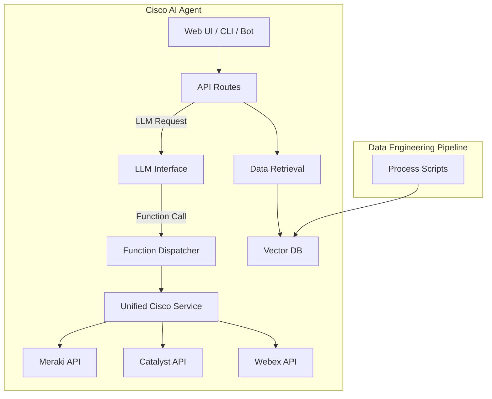

 

---

# Cisco Platform AI Project

> **DISCLAIMER — USE AT YOUR OWN RISK**
> This software is provided **“as is”**, without warranty of any kind.
> Cisco Systems, Inc. and contributors accept **no liability** for damages arising from its use.
> Intended **solely for demonstration and development**.
> By cloning or running the code, you confirm acceptance of these terms.

---

## 🚀 Project Overview

The **Cisco Platform AI Project** provides a modular framework for building intelligent, retrieval-augmented Gen-AI solutions tailored to Cisco platforms—such as **Meraki**, **Catalyst Center**, **Webex**, **Nexus**, and **Spaces**.

It supports rapid prototyping for AI-driven chatbots, copilots, and IT automation pipelines by leveraging live Cisco APIs, configurable LLMs, and powerful vector-based retrieval systems.

---

## 🔑 Key Features

| Capability                | Benefit                                                                                            |
| ------------------------- | -------------------------------------------------------------------------------------------------- |
| **Pluggable Stack**       | Swap LLMs (Azure OpenAI, Llama 3, Hugging Face) and vector DBs (Azure AI Search, Chroma, Elastic). |
| **Layered RAG**           | Isolate indexes per use case: API docs, events, business logic, and detailed CoT documentation.    |
| **Live Function Calling** | Dynamically execute real Cisco API calls from LLM-emitted JSON responses.                          |
| **Unified Cisco Service** | Meraki, Catalyst, Webex, and others unified into one extensible abstraction layer.                 |
| **Automated Scaffolding** | Autogenerate OpenAPI specs, platform SDKs, dispatchers, and service stubs.                         |
| **OpenTelemetry Tracing** | Gain visibility into all stages of processing: chunking, embeddings, LLM latency, API execution.   |
| **Sample UI**             | Web-based HTML/JS frontend included for immediate demo access.                                     |

---

## 🧠 Architecture Overview



---

## 📁 Repository Structure

```
suite-cisco-ai-building-blocks/
├── LICENSE
├── README.md                       # ← this file
├── Makefile
├── assets/                         # banners & diagrams
├── env.example                     # base environment config
├── chroma_dbs/                     # local vector DB content (ignored)
├── src/
│   ├── app/                        # FastAPI AI Agent
│   │   ├── routers/                # HTTP routes
│   │   └── user_commands/          # CLI interaction
│   ├── db_scripts/                 # indexing + processing logic
│   └── source_open_api/            # OpenAPI input specs
├── docs/
│   ├── getting_started.md          # ✅ New: step-by-step setup
│   ├── example_environment_variables_guide.MD  # ✅ New: .env breakdown
│   └── nginx.sample                # optional NGINX config
└── pyproject.toml                  # CLI entry points and setup
```

---

## ⚡ Quick Start

```bash
# 1. Clone the repository
git clone https://github.com/APO-SRE/suite-cisco-ai-building-blocks.git
cd suite-cisco-ai-building-blocks

# 2. Create and activate a Python virtual environment
python3 -m venv .venv
source .venv/bin/activate

# 3. Configure your environment
cp env.example .env
# Then edit .env to configure platforms, credentials, backends, etc.

# 4. Install required modules (includes FastAPI and Uvicorn)
pip install -r requirements.txt
pip install -e .

# 5. Index data (optional but recommended)
create-domain-demo-index
create-events-index
create-platform-index

# 6. Start the AI Agent (FastAPI server)
uvicorn app.main:app --reload

# 7. Open browser UI
http://127.0.0.1:8000/static/
```

---

## 🧪 CLI Commands

After installation, these commands are available:

| Command                    | Description                                                          |
| -------------------------- | -------------------------------------------------------------------- |
| `menu`                     | Launch interactive CLI menu                                          |
| `create-sdk`               | Generate a Python SDK from OpenAPI spec (required for new platforms) |
| `create-platform`          | Scaffold a new Cisco platform integration                            |
| `create-platform-routes`   | Add routes for that platform to the FastAPI layer                    |
| `create-platform-index`    | Index the platform’s API functions                                   |
| `create-domain-demo-index` | Build indexes from sample structured data (demo-ready)               |
| `create-events-index`      | Enrich LLM retrieval with telemetry and events                       |

A built-in **Platform Registry** tracks and manages platform integrations and AI configurations.

---

## ⚙ Environment Variable Overview

The `.env` file configures platform access, feature toggles, and backend providers.

To **edit interactively**, use the CLI and choose option **#19 – Manage .env files**:

```bash
# From project root
menu
# Then select: 19 – Manage .env files
```

You can also manually edit `.env` or refer to the detailed guide:
👉 [`docs/example_environment_variables_guide.MD`](docs/example_environment_variables_guide.MD)

| Prefix     | Layer / Context                        | Example Content                           |
| ---------- | -------------------------------------- | ----------------------------------------- |
| `FASTAPI_` | API schema / OpenAPI ingestion         | JSON definitions, titles, parameter names |
| `EVENTS_`  | Log/event enrichment                   | Syslogs, SNMP, streaming events           |
| `DOMAIN_`  | Structured business data               | KBs, support docs, industry templates     |
| `AGENTIC_` | Detailed multi-step logic / CoT assets | Whitepapers, agent instructions, runbooks |

---

## 📚 Documentation

* ✅ [Getting Started Guide](docs/getting_started.md)
* ✅ [Environment Variables Reference](docs/example_environment_variables_guide.MD)
* 🛠️  Optional: [NGINX Sample Config](docs/nginx.sample)

---

## 📜 License

**Apache License 2.0**
© 2025 Cisco Systems, Inc. — All rights reserved

---

*Made with ❤️ by the Cisco Platform AI Project Team*
*Last updated: **June 2025***

---

 