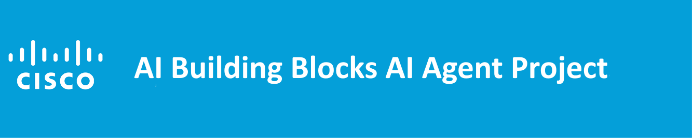
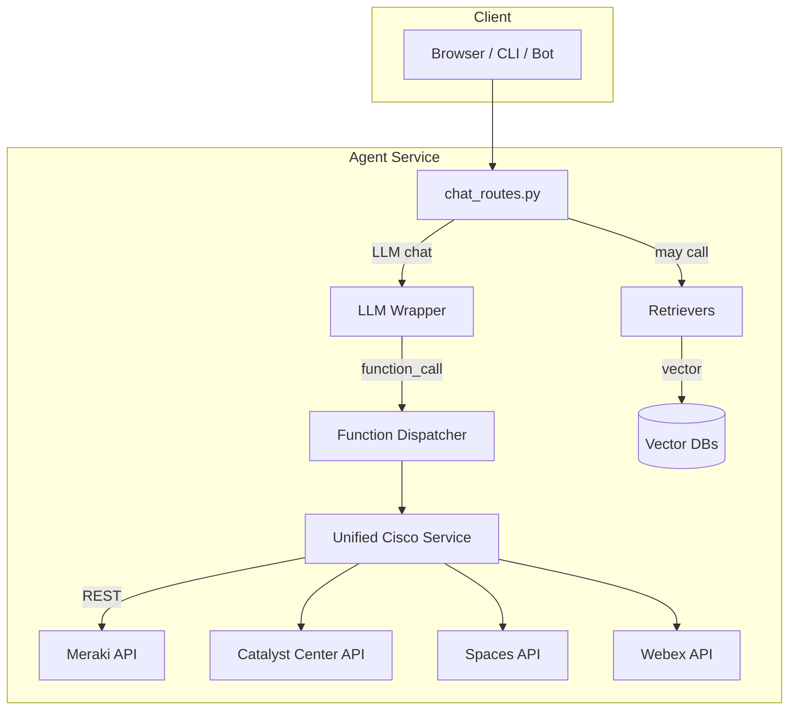

# Cisco AI Building Blocks — Agent Service

> **DISCLAIMER — USE AT YOUR OWN RISK**
> This software is provided *“as is”*, without warranty of any kind. Cisco Systems, Inc. and contributors shall not be liable for any claim, damages, or other liability arising from its use. This project is intended **solely for demonstration and development**. By using the code you acknowledge that you have read, understood, and accepted these terms.

---

## What is the Agent Service?

The **Agent Service** is the runtime half of the *Cisco AI Building Blocks Suite*.

* **Agent Service (this repo)** — FastAPI micro‑service that merges an LLM, retrieval‑augmented generation (RAG), and live Cisco platform APIs.
* **Database Project** — companion pipeline that builds the vector indexes (Azure AI Search, Chroma, Elastic, …) consumed by the Agent.

Together they form a turnkey sandbox for exploring Gen‑AI‑powered automation on Cisco Meraki, Catalyst Center, Spaces, Webex, and more.

---

## 1 · Features

| Capability                | Summary                                                                                                    |
| ------------------------- | ---------------------------------------------------------------------------------------------------------- |
| **Chat + RAG**            | Context‑aware chat backed by domain, API‑docs, and event indexes built by the Database Project.            |
| **Function calling**      | The LLM can emit `function_call` JSON; a dispatcher triggers real Cisco REST APIs and returns live data.   |
| **Unified Service layer** | One abstraction for Meraki, Catalyst, Spaces, Webex (extendable to Nexus, XDR, etc.).                      |
| **Pluggable stack**       | Swap LLM (Azure OpenAI, Llama 3, local HF) and vector back‑end (Chroma, Azure Search, Elastic) via `.env`. |
| **Static sample UI**      | A minimal HTML/JS front‑end in `static/` shows how to query the agent and render results.                  |

---

## 2 · High‑Level Architecture

*Vector DBs* are produced by the **Cisco AI Building Blocks Database** project.

---

## 3 · Environment Blocks

The suite uses consistent env‑var prefixes:

* **DOMAIN\_**\* — domain knowledge / summaries layer
* **FASTAPI\_**\* — API‑docs layer
* **EVENTS\_**\* — raw events layer
* **AGENTIC\_**\* — (reserved) future agent‑of‑agents layer

See [`env‑guide.md`](example_environment_variables_guide.MD) for a full cheat‑sheet.

---

## 4 · Extending the Suite

1. **Add a Cisco platform** → implement a `CiscoXClient` + register in `unified_service.py`.
2. **New vector store** → write a retriever under `retrievers/` and set `<LAYER>_VECTOR_BACKEND`.
3. **New LLM** → implement `BaseLLM` subclass and configure `<LAYER>_LLM_PROVIDER`.

PRs welcome!

---

## 5 · License

Apache 2.0 • (c) 2025 Cisco Systems, Inc.

---

*Made with ❤️ by the Cisco AI Building Blocks team.*
